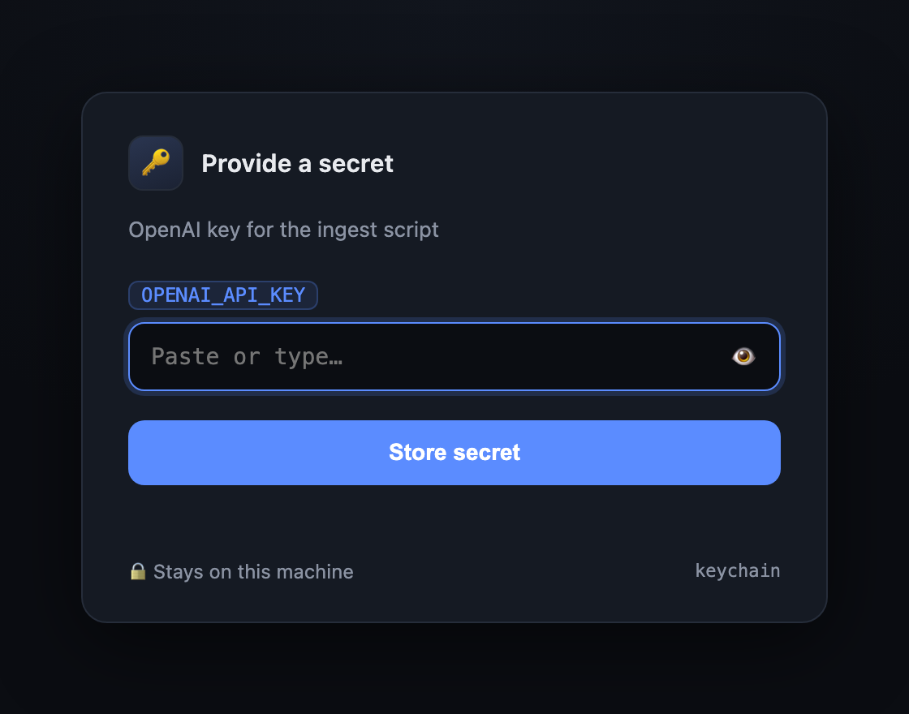

<div align="center">
<h1>🔑 keyhole</h1>

<p>Hand a secret to your AI coding agent without pasting it in the chat</p>
</div>

---

<p align="center">
  
</p>

Your agent needs an API key to run a command. Normally you'd paste it into the
chat — where it lands in the model's context, the transcript, and any logs.
`keyhole` opens a one-field form on `localhost`, you type the secret there,
and the value goes straight to a store (macOS Keychain, a file, or an env file).
The agent gets back **only a reference** — never the value.

## Prerequisites

- [Bun](https://bun.sh) (the CLI runs as TypeScript, no build step)
- macOS for the `keychain` destination; `file:`/`env:` work anywhere

## Install

As a Claude Code plugin:

```bash
claude plugin add github:maferland/keyhole
```

Or link the CLI onto your PATH:

```bash
git clone https://github.com/maferland/keyhole
cd keyhole && bun link
```

## Usage

```bash
keyhole OPENAI_API_KEY --context 'OpenAI key for the ingest script'
```

Pass several names for one form with a field per secret:

```bash
keyhole OPENAI_API_KEY ANTHROPIC_API_KEY --dest env:./.env.local
```

The command opens the form, **blocks** until you click **Store**, then prints
one JSON line on **stdout** — the references, with no secret values:

```json
{
  "stored": true,
  "secrets": [
    {
      "name": "OPENAI_API_KEY",
      "dest": "keychain:OPENAI_API_KEY",
      "retrieve": "security find-generic-password -s OPENAI_API_KEY -a $USER -w"
    }
  ]
}
```

Use each secret by expanding its `retrieve` reference at runtime, so the value
is never captured:

```bash
curl -H "Authorization: Bearer $(security find-generic-password -s OPENAI_API_KEY -a $USER -w)" ...
```

### Destinations

Where the value lives is independent of how it gets there. Pick with `--dest`:

| `--dest`              | Stored as                               | Multiple secrets |
| --------------------- | --------------------------------------- | ---------------- |
| `keychain`            | macOS Keychain, service = `<name>`      | ✓ (default)      |
| `keychain:my-service` | Keychain under a custom service name    | ✓                |
| `file:/path`          | raw value in a `0600` file              | single only      |
| `env:/path`           | `NAME=value` lines in a `0600` env file | ✓                |

### Options

| Flag        | Default | Meaning                          |
| ----------- | ------- | -------------------------------- |
| `--context` | —       | hint shown in the browser form   |
| `--port`    | `0`     | `0` picks a random free port     |
| `--timeout` | `300`   | seconds to wait before giving up |

## How it works

A localhost-only HTTP server serves the form on a random, unguessable URL path.
On submit, each value is written directly to the chosen destination and the
references are printed to stdout. Raw values never touch stdout, are never
logged, and are never read back by the agent.

Guards:

- binds `127.0.0.1` only; `Host` must be loopback on the chosen port (defeats DNS-rebinding)
- random URL token per run; any other path 404s
- rejects cross-origin POSTs
- single-use: stores once, then 409s further submits
- distinct exit codes: `0` stored, `2` timed out, `3` store failure

## Security notes

- `keyhole` keeps the value out of the **agent's context** — that is its
  job. It is not at-rest encryption. `file:`/`env:` destinations are plaintext
  on disk (mode `0600`); `keychain` is encrypted at rest.
- The `keychain` destination passes the value on `argv`, briefly visible to
  `ps` on a multi-user machine. On a shared box prefer `file:` or `env:`.

## Develop

```bash
bun install
bun test          # vitest: unit + in-process integration
bunx tsc --noEmit
```

## License

[MIT](LICENSE)
